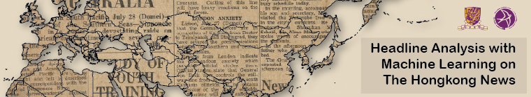

# hknews-headline-analysis

## Introduction

Digital scholarship tools nowadays offer scholars multiple options to explore the complex past. They can browse through
an interactive timeline, study the vast amount of digitized textual content, or delve into significant events through
newspaper headlines. This project delves into issues of narrative time and space, embracing a concept of geography as a
place to discover the contemporary lives connected to newspaper articles. Time is another fundamental element of
narrative that can be utilized for storytelling in digital scholarship. The project explores how new digital tools allow
us to comprehend newspaper content within the context of time and space, enabling the convergence of geography and
history through sophisticated text-mining computational algorithms. The objective is to provide scholars with access to
the content from various perspectives, aiming to understand newspaper articles through a non-conventional approach.

The digital scholarship project is strictly intended for nonprofit and academic purpose.

## Methodology

- Object Detection - YOLOv5
   Our team extended the model provided by Ultralytics on GitHub and trained an object detection model. Despite
  having a relatively small training dataset compared to other business object detection tasks, we were pleasantly
  surprised to achieve acceptable results. -- [Code Demo](./object_detection_yolo.ipynb)
- Data Extraction - spaCy and Google API
   Name Entity Recognition (NER) is a task of information extraction that seeks to locate named entities, such as
  persons, places, and countries. In our project, spaCy, an open-source NLP Python library, has been chosen for
  extracting name entities. Using the NER, our team extracted up to 2,700 places objects from newspaper headlines.
  -- [Code Demo](./data_extraction_spacy.ipynb)
   Geocoding is the process of converting addresses into geographic presentations. In this project, Google Geocoding
  API has been chosen in finding the coordinate of the places that appeared in the newspaper. Using geocoding, there
  were up to 400 coordinates have been found. -- [Code Demo](./geocoding_google.ipynb)
- Geospatial Visualization - Folium
   Our team employed Folium, an open-source library for displaying geospatial data. Folium allows us to mark the
  GPE (Geo-Political Entities) entities, such as countries, and cities on an interactive map. With some modifications to
  our data, we utilized Folium to make an interactive map with tags of places.
  -- [Code Demo](./visualization_folium.ipynb)

## The Data
The "Hong Kong Early Tabloid Newspapers"《香港早期小報》, launched in 2022, has compiled tabloid newspapers published in Hong Kong during the 20th century. Unlike the seriously broadsheet newspapers, tabloids catered to the leisure and entertainment interests of the masses, covering topics such as politics, operas, dramas, comics, and pornography, among others. In this project, we analyze The Hongkong News from our Hong Kong Early Tabloid Newspapers Collection using the aforementioned approaches. The Japanese Occupation edition of The Hongkong News commenced publication in 1941 shortly after the Christmas Day surrender of the British Crown Colony and continued until August 17, 1945, just a week before Hong Kong's liberation. The publication of The Hongkong News during the Japanese Occupation provides scholars with insights into Japan's perspective from Hong Kong.

## Motivation
Current digital assets can be utilized to provide value beyond preservation and online access. There is ample room for optimizing the usage of digitized images. In addition to images, our team will employ various computational techniques to explore additional value in this tabloid newspaper. Another challenge for users is gaining concrete insights from the newspaper content, especially when dealing with large-scale corpora. To address this challenge, we have implemented headline analysis as a useful tool for newspaper topic analytics. Our project has two main objectives. Firstly, providing two semi-automatic procedures for recognizing and extracting newspaper headlines. Secondly, developing two visualization products to enhance users' access to our digital repository. These visualization products not only provide scholars with insights into headlines across different times and spaces but also enable them to address humanities-related questions, such as "Which battles were the focus of Japanese propaganda at specific times?" and "How did Japanese propaganda evolve during the war?"

This project covers 530 issues of The Hongkong News from the years 1942 to 1945. The related dataset is available at the CUHK Research Data Repository, while the digital images of The Hongkong News are accessible in the CUHK Digital Repository.

## Acknowledgement

CUHK Research Data Repository: https://doi.org/10.48668/E6JEKD
 CUHK Digital Repository: https://repository.lib.cuhk.edu.hk/en/collection/cuhk-hk-tabloid
 YOLOv5 GitHub: https://github.com/ultralytics/yolov5
 spaCy website: https://spacy.io/
 Folium GitHub: https://python-visualization.github.io/folium
